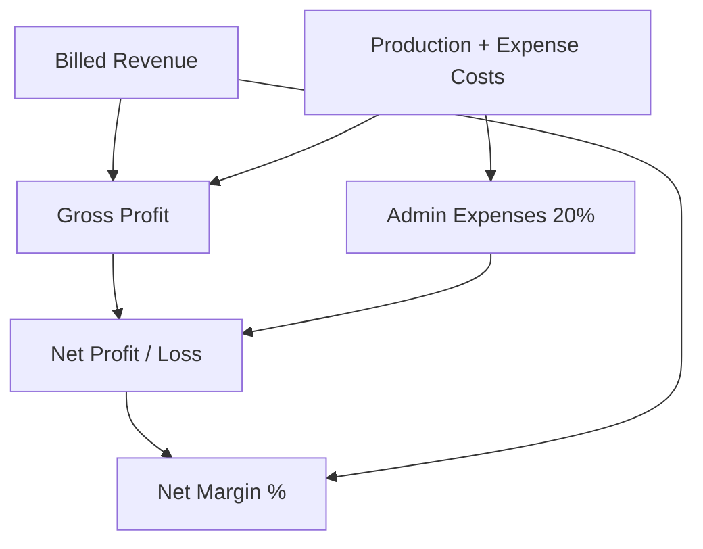

# Project Summary & Analysis Report - Calculation Guide (Functional)

This document provides a clear, business-friendly explanation of how the values, metrics, and percentages are calculated in the **Project Summary Report** and the **Project Analysis Report Modal**. 

---

## 1. Core Data Sources
The report pulls data by combining standard NetSuite transactions with your custom project tracking records:

| Business Term | NetSuite Technical Source | Description |
| :--- | :--- | :--- |
| **Project / Product Order** | `customrecord_njt_product_order` | The base record tracking the project. |
| **LPO Value (Expected Revenue)** | Sales Order Total (`transaction.total`) | The total contract value approved on the Sales Order linked to the Product Order. |
| **Revenue Booked** | Invoices (`transaction` where type is `CustInvc`) | Sum of all Billed Invoices created from the Sales Order (excluding tax lines). |
| **Production Details (Material/Prod Cost)**| `customrecord_njt_prod_deta` | Internal costs recorded for items, labor, or machinery on the project. |
| **Other Expenses** | `customrecord_expense` | External expenses or manual costs logged directly against the project. |

---

## 2. Main Summary Grid Calculations
Each row in the main report dashboard represents one project/product order and calculates metrics as follows:

### Formulas:
1. **LPO Value**: 
   * The total amount of the associated Sales Order.
2. **Revenue**: 
   * Sum of all billed invoice line amounts linked to the Sales Order.
3. **Expenses**: 
   * $\text{Production Details Amount} + \text{Other Expense Records Amount}$
4. **Gross Profit / (Loss)**: 
   * $\text{Revenue} - \text{Expenses}$
5. **Admin Expenses**: 
   * $\text{Expenses} \times 20\%$
6. **Net Profit / (Loss)**: 
   * $\text{Gross Profit} - \text{Admin Expenses}$
7. **% of Profit / (Loss) [Net Margin %]**: 
   * $\frac{\text{Net Profit}}{\text{Revenue}} \times 100\%$ (relative to the Billed Revenue).

---

## 3. Top-Level Dashboard KPI Cards
The metrics bar at the top of your dashboard aggregates data across all visible projects:

*   **Total LPO Value**: Sum of LPO Values for all filtered projects.
*   **Total Revenue**: Sum of Billed Revenue for all filtered projects.
*   **Total Expenses**: Sum of Expenses for all filtered projects.
*   **Gross Profit / (Loss)**: $\text{Total Revenue} - \text{Total Expenses}$
*   **Total Admin Expenses**: Sum of Admin Expenses for all filtered projects.
*   **Net Profit / (Loss)**: $\text{Total Gross Profit} - \text{Total Admin Expenses}$
*   **Net Margin**: $\frac{\text{Total Net Profit}}{\text{Total Revenue}} \times 100\%$

---

## 4. Project Analysis Report (Modal Detail) Calculations
When you click **Details** on any project row, it opens a breakdown modal. Here is how the columns are populated:

### Columns:
*   **Expected Revenue & Expenses**: Represents the original plan/budget. For the revenue line, this displays the **LPO Value**.
*   **Revenue & Expenses Booked**: Displays actual booked/actualized transactions.

### Expense Categorization:
Costs are split into three main buckets based on where and how they were logged:
1.  **Material Cost**: Production details (`customrecord_njt_prod_deta`) where the category name contains the word **"MATERIAL"**. These are grouped and summed by the item type code.
2.  **Other Production Cost**: Production details where the category name does **not** contain the word "MATERIAL". These are grouped and summed by the item name.
3.  **Other Expenses**: Direct expense records (`customrecord_expense`) linked to the project. These are grouped and summed by the remarks/memo field.

### Modal Profitability Formulas:
*   **Total Expenses**:
    $$\text{Total Material} + \text{Total Production Cost} + \text{Total Other Expenses}$$
*   **Profit / (Loss)**:
    $$\text{Revenue Booked} - \text{Total Expenses}$$

### Modal Percentages `(%)`:
To help analyze cost weight, the modal calculates a percentage next to each category total (e.g., `TOTAL OF MATERIAL COST (27%)`). The system decides the base denominator using the following logic:
1.  **If Billed Revenue > 0**:
    $$\text{Percentage} = \frac{\text{Category Amount}}{\text{Revenue Booked}} \times 100\%$$
2.  **If Billed Revenue is 0, but LPO Value > 0**:
    $$\text{Percentage} = \frac{\text{Category Amount}}{\text{LPO Value}} \times 100\%$$
3.  **Otherwise**: $0\%$

*All percentages are rounded to the nearest whole percentage value.*
